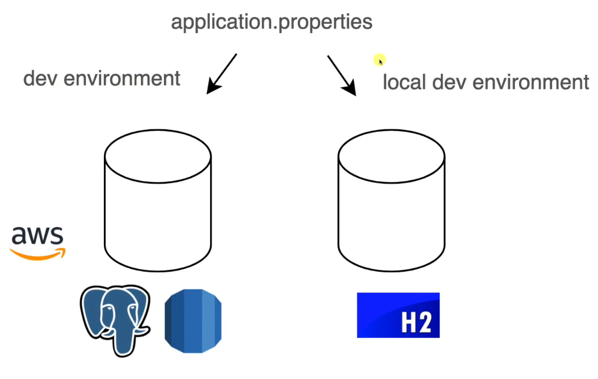

# Proterties

In config class we can access to application properties by using @Value annotation like that:
```
@Configuration
public class CustomerConfig {

    @Value("${info.app.name}")
    private String appName;

    @Value("${info.app.version}")
    private String appVersion;

}
```

Another way to get access these properties is by creating and instance of Enviroment class:

```
@Configuration
public class CustomerConfig {
    private Environment environment;

    public CustomerConfig(Environment environment) {
        this.environment = environment;
    }

    @Bean
    CommandLineRunner commandLineRunner() {
            System.out.println(environment.getProperty("info.app.description"));
        };
    }
}
```

But the correct way may be using `@ConfigurationProperties` annotation:
check InfoApp and InfoDB classes

# Profiles
We can add different profiles to work with and each one may have different settings
in order to work properly depending on whether we are developping on local or not



By activating one of these profiles only have to pass the value as a program argument: `--spring.profiles.active=dev`

Once the application is packaged you can run multiple instances of it with different settings from the command line just like that:
- `java -jar [applicationName].jar --spring.profiles.active=dev`
- `java -jar [applicationName].jar --spring.profiles.active=default --server.port=3000`