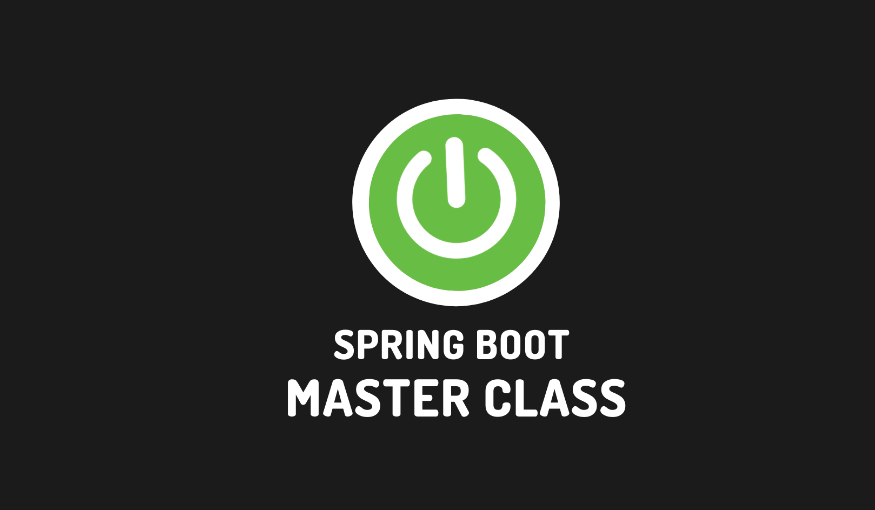

Spring Boot is a powerful framework to build web applications quickly, using less code

## List of topics

- Restful API's 
- Logging 
- N Tier Architecture 
- Spring Boot Actuator 
- Dependency Injection 
- Unit Tests 
- Integration Tests 
- JSON Serialisation and Deserialisation 
- Java Beans Validation 
- Open Feign 
- Exception Handling 
- Lombok 
- Running Spring Boot Applications

### N Tier Architecture
